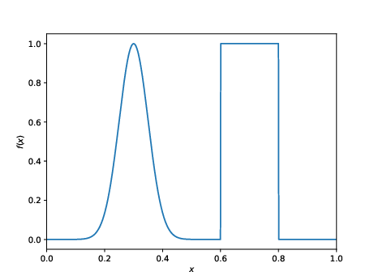
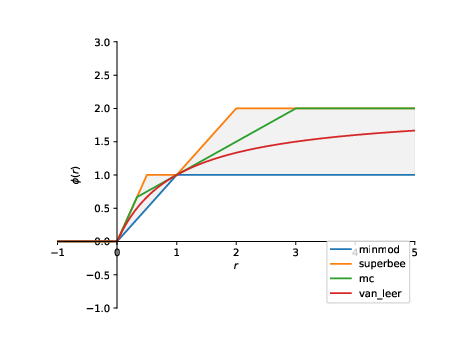

# NUMERATE
My contribution to a final year mathematics group honours project titled _Numerical Methods for Solving the Advection Equation_. This project, conducted with two others, culminated in a 50 page report of our findings and a 30 minute presentation given to peers and professors. 

# The Equation
The advection equation is given as $\frac{\partial u}{\partial t} + a \frac{\partial u}{\partial x} = 0$, where $a$ (the wave speed) is some constant. The exact solution to this equation, given periodic spacial boundaries and an initial condition $u(0, x) = f(x)$, is given as $u(t, x) = f(x - at)$. 

# The Package
This Python package contains code for numerically solving the 1-D advection equation. It implements various finite difference schemes and flux limiters. The contents of this package were intended to show the properties of various numerical methods. Hence, some methods are unstable and not meant to be used practically.

# Examples and Results
In the following examples, we use the initial condition shown in the figure below over the spacial interval $[0, 1]$.

## Lax-Wendroff
The Lax-Wendroff scheme gives the below results (orange) overlayed with the exact solution (blue). 

## Van Leer Flux Limiter 
The van Leer flux liniter gives the below results (orange) overlayed with the exact solution (blue). 

## Sweby Diagram
The Sweby diagram can be used to find flux limiter functions which yield second-order accurate, TVD schemes.

